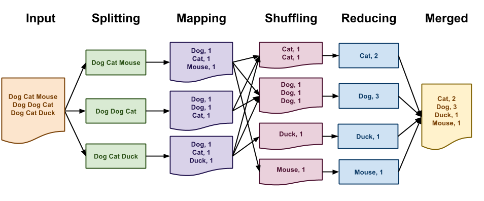
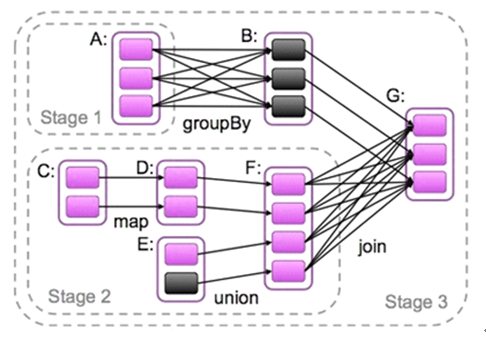
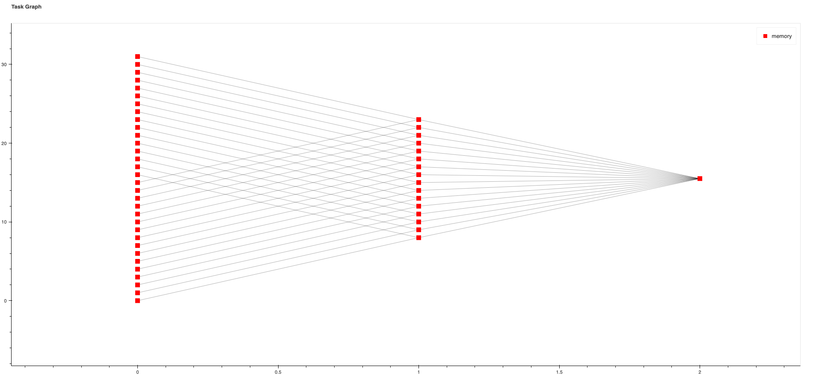
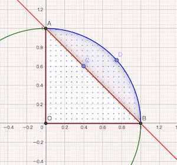

# 分布式数据框架计算引擎研习


## distributed computing frameworks

> spark, impala, bigquery, dask .etc


## Big Concept

#### 1, `MapReduce`


*(Calculate Word Count by MapReduce)*

MapReduce采用``“分而治之”``策略。MapReduce将复杂的、运行于大规模集群上的并行计算过程高度地抽象到了两个函数：Map和Reduce。一个存储在分布式文件系统中的大规模数据集，会被切分成许多独立的分片（split），这些分片可以被多个Map任务并行处理。通过Reduce最终把各个分片任务中间结果合并成一个结果。

#### 2, `DAG(Directed Acyclic Graph)有向无环图`


*(Spark DAG Demo)*

RDD算子构建了RDD之间的关系，整个计算过程形成了一个由RDD和关系构成的DAG。点就是RDD（或者stage）, 线就是RDD算子（或者宽依赖算子）

```text
我们使用 spark-submit 提交的就是一个 application， 一个 application 可以有很多job。
对 RDD 进行 action操作时，就会产生一个Job。
每一个Job 又会根据 shuffle 操作，分为多个stage。
一个stage会根据RDD的分区数，分为多个task。
```

#### 3, `MLST (Multi-Level Service Tree)`


*(An example of Dremel Service-Tree)*

根服务器收到此查询时，首先要做的是将查询转换为可以由下一级别的服务树处理的形式。它确定表T的所有分片，然后简化查询。
在这里，R11，R12，...R1n是发送到服务树的第1级的Mixer 1,...,n的查询结果。
`R1i = SELECT A, COUNT(B) AS c FROM T1i GROUP BY A`
下一步Mixer修改传入的查询，以便它们可以将其传递给Leaf节点。叶子节点接收自定义查询并从Colossus(数据存储层)分片读取数据。Lead节点读取查询中提到的列或字段的数据。当叶节点扫描分片时，它并行地浏览打开的列文件，一次一行。


## spark vs impala

Impala查询器将所有内容缓存在内存中，而Spark将需要时间来提取此数据以执行查询计划。

shuffle实现方式, Spark在stage边界将临时文件写入磁盘，然而Impala尝试将所有内容保留在内存中。 Spark可以从丢失执行程序中恢复并通过重新计算丢失的块继续运行, Impala在单个impalad守护程序崩溃后将使整个查询失败。

工作分配机制不同 -- Spark(DAG)将编译生成后的整个阶段代码发送给workers，Impala(MLST)只传递声明式查询片段。

~~"查询优化技术（查询矢量化，动态分区修剪，基于成本的优化）-平分秋色，提升点也差不多。"~~


## Dask Example


*(Dask Task Graph Example)*

`积分方式计算ACBD区域面积`

> *`sum(y0(x) - y3(x) for x in x_range)`*

```python
n = 16
delta_x = 1 / n
x_range = [i / n for i in range(n)]

def y0(x):
    """y0 = sqrt(1-x^2)"""
    import math
    return delta_x * math.sqrt(1 - x * x)


def y3(x):
    """y3 = 1 - x"""
    return delta_x * (1 - x)

a_quarter_circle_y = client.map(y0, x_range)
a_triangle_y = client.map(y3, x_range)
a_target_s = client.map(operator.sub, a_quarter_circle_y, a_triangle_y)
a_target = client.submit(sum, a_target_s)
# a_target.result()
# 0.28081325945693536
```


## dask vs spark

**Spark和Dask都用有向无环图表示计算。但是这些图的粒度不同。**

在Spark RDD上执行的一项操作可能会将一个节点（例如Map和Filter）添加到图形中。这些是传达含义的高级操作，最终将变成许多要在单个工人上执行的小任务。这个小任务状态仅在Spark调度程序内部可用。（Spark stage 是一个物理执行单位。stage 是一组并行任务 - 每个分区一个任务。）

Dask跳过了这种高级表示，而直接进入了许多小任务阶段。这样，对Dask集合进行一次映射操作将立即生成并可能将数千个微小任务添加到Dask图中。

基础图规模的这种差异影响着可以进行的分析和优化的种类，也影响了用户暴露给用户的普遍性。 Dask无法执行Spark进行的某些优化，因为Dask调度程序没有自上而下执行的计算的图。但是，Dask能够轻松代表更复杂的算法，并将这些算法的创建向普通用户公开。


## 参考链接

- https://data-flair.training/blogs/dag-in-apache-spark/
- https://storage.googleapis.com/pub-tools-public-publication-data/pdf/36632.pdf
- https://panoply.io/data-warehouse-guide/bigquery-architecture/
- https://docs.dask.org/en/latest/spark.html
- https://www.jianshu.com/p/8c7e0f5ff326
- https://waltyou.github.io/Spark-Tuning-Practice/
- https://waltyou.github.io/Mastering-Apache-Spark-Core-7-Services-DAGScheduler/
- https://stackoverflow.com/questions/58598727/impala-vs-spark-performance-for-ad-hoc-queries
